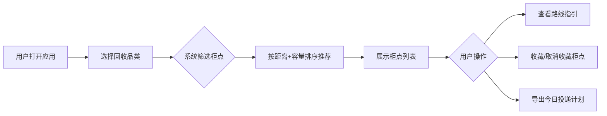

## 1. 产品概述

旧物回收柜投递指引单页应用，帮助用户快速找到附近可投递的回收柜点，支持品类筛选、柜点推荐、收藏管理和投递计划导出。
- 面向城市居民用户，解决回收柜难找、满柜无法投递、品类不匹配等痛点
- 提升回收便利性，促进环保行为落地

## 2. 核心功能

### 2.1 用户角色
| 角色 | 注册方式 | 核心权限 |
|------|---------|---------|
| 普通用户 | 无需注册（本地存储） | 选择品类、查看柜点、收藏柜点、导出投递计划 |

### 2.2 功能模块
1. **品类选择区**：纸类、塑料、金属、织物四大品类切换
2. **柜点推荐列表**：根据剩余容量和品类支持推荐最近可用柜点
3. **步行路线简述**：展示从当前位置到柜点的步行路线指引
4. **收藏柜点**：收藏/取消收藏常去柜点，本地持久化
5. **投递计划导出**：导出今日投递计划为文本文件
6. **状态提示**：满柜、暂不接收品类等异常状态明确提示

### 2.3 页面详情
| 页面名称 | 模块名称 | 功能描述 |
|---------|---------|---------|
| 主页面 | 品类选择器 | 四个品类卡片，点击选中，高亮显示当前选择 |
| 主页面 | 状态横幅 | 展示当前选择品类、柜点数量统计 |
| 主页面 | 柜点列表 | 按推荐优先级排序，展示距离、容量、支持品类、收藏按钮 |
| 主页面 | 路线指引 | 展开柜点卡片显示步行路线简述 |
| 主页面 | 收藏柜点区 | 独立区域展示已收藏的柜点 |
| 主页面 | 导出按钮 | 一键导出今日投递计划为 .txt 文件 |
| 主页面 | 状态提示 | 满柜红色警示、暂不接收品类灰色禁用标识 |

## 3. 核心流程

用户打开应用 → 选择投递品类 → 系统自动筛选并排序推荐柜点 → 用户查看柜点详情和路线 → 可收藏柜点或导出投递计划

## 4. 用户界面设计

### 4.1 设计风格
- **主色调**：森林绿 #2D6A4F（环保主题），搭配暖米色 #FEFAE0 背景
- **辅助色**：琥珀橙 #E9C46A（强调）、深红 #E63946（警示）、灰色 #6C757D（禁用）
- **按钮风格**：圆角胶囊按钮，选中态绿色填充，悬停微上浮阴影
- **字体**：标题使用 Lora（衬线），正文使用 Noto Sans SC（无衬线），体现自然与现代结合
- **布局风格**：卡片式布局，分区清晰，留白舒适
- **图标**：使用 lucide-react 图标库，线性风格

### 4.2 页面设计概览
| 页面名称 | 模块名称 | UI 元素 |
|---------|---------|---------|
| 主页面 | 品类选择器 | 4 列等宽卡片，图标 + 品类名 + 说明，选中态绿色边框 + 浅绿背景填充 |
| 主页面 | 柜点卡片 | 左侧距离徽标，中间柜点名 + 地址 + 容量进度条 + 支持品类标签，右侧收藏星形按钮 |
| 主页面 | 路线指引 | 展开式面板，步数图标 + 步行时间 + 路线文字描述 |
| 主页面 | 状态标识 | 满柜：红色 Badge「已满」；暂不接收：灰色 Badge「不支持」 |
| 主页面 | 导出区域 | 底部悬浮操作栏，左侧已选投递计划计数，右侧导出按钮 |

### 4.3 响应式设计
- Desktop-first 设计，主内容区最大宽度 1200px 居中
- 平板：品类选择器 2x2 网格，柜点列表单列
- 手机：品类选择器横向滚动或 2x2，所有模块单列堆叠，底部导出栏固定

### 4.4 视觉细节
- 背景：米色底色叠加细微噪点纹理，营造环保自然质感
- 卡片：白色背景 + 极细绿色边框 + 柔和阴影，悬停时阴影加深
- 动画：品类切换渐入淡出、柜点卡片展开平滑过渡、收藏按钮心形弹跳效果
- 容量进度条：绿/黄/红三色渐变，根据剩余比例自动变色
