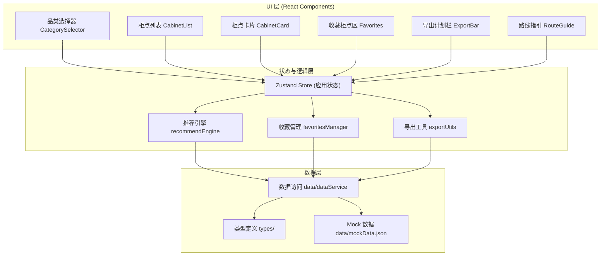

## 1. 架构设计



## 2. 技术说明
- **前端**：React@18 + TypeScript + Vite + TailwindCSS@3 + Zustand
- **初始化工具**：vite-init (react-ts 模板)
- **后端**：无，纯前端静态应用
- **数据存储**：本地 JSON Mock 数据 + localStorage 持久化收藏
- **图标**：lucide-react
- **部署**：Docker + Nginx 托管静态构建产物

## 3. 路由定义
| 路由 | 用途 |
|------|------|
| / | 主页面（所有功能集成于单页） |

## 4. 数据模型

### 4.1 类型定义

```typescript
// 回收品类
type Category = 'paper' | 'plastic' | 'metal' | 'fabric';

// 柜点格口状态
interface CompartmentStatus {
  category: Category;
  total: number;
  used: number;
  accepted: boolean;
}

// 柜点信息
interface Cabinet {
  id: string;
  name: string;
  address: string;
  distance: number; // 米
  walkMinutes: number;
  routeDescription: string;
  compartments: CompartmentStatus[];
  latitude: number;
  longitude: number;
}

// 推荐结果
interface RecommendationResult {
  cabinet: Cabinet;
  availableCapacity: number;
  isFull: boolean;
  isAccepted: boolean;
  score: number; // 推荐评分
}

// 投递计划项
interface DeliveryPlanItem {
  category: Category;
  cabinet: Cabinet;
  timestamp: number;
}

// 应用状态
interface AppState {
  selectedCategory: Category | null;
  cabinets: Cabinet[];
  favorites: string[]; // cabinet id 列表
  deliveryPlan: DeliveryPlanItem[];
}
```

### 4.2 Mock 数据结构
- 至少 8 个柜点数据
- 覆盖不同距离（200m - 2km）
- 覆盖不同容量状态（空闲、中等、已满）
- 覆盖不同品类支持情况（部分柜点不支持某些品类）

## 5. 核心逻辑说明

### 5.1 推荐算法
1. 过滤：筛选支持当前品类且未被禁用的柜点
2. 评分：`score = (1 / distance) * 0.4 + (remainingCapacity / totalCapacity) * 0.6`
3. 排序：按 score 降序排列
4. 标识：满柜柜点排在列表末尾并标红

### 5.2 数据层、逻辑层、UI 分离
- **数据层** (`src/data/`)：纯数据和类型，无业务逻辑
- **逻辑层** (`src/logic/`)：推荐算法、收藏管理、导出工具，无 UI 依赖
- **UI 层** (`src/components/`)：仅负责渲染和用户交互，通过 Store 调用逻辑

## 6. Docker 部署
- 使用多阶段构建：node:18-alpine 构建 → nginx:alpine 托管
- 暴露 80 端口
- 构建产物位于 /usr/share/nginx/html
